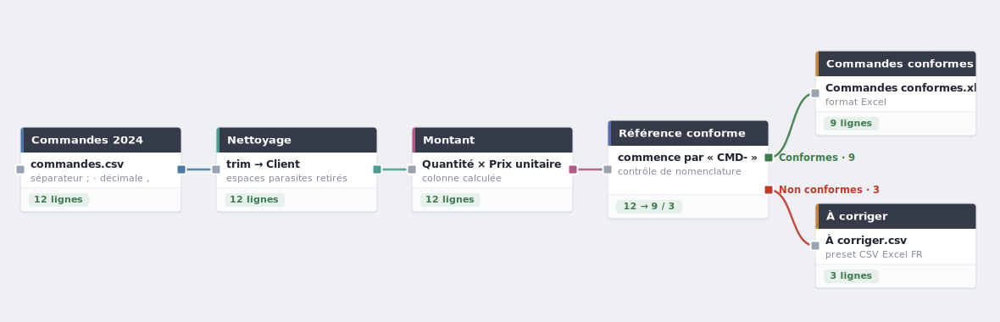

# Roade

[](https://github.com/MaloLeCouls/Roade/actions/workflows/ci.yml)

> Du breton *« Roadenn »*, « donnée » en français.

**Roade transforme des fichiers Excel/CSV en assemblant des blocs sur un
canevas** — la logique d'un traitement SQL, sans écrire de SQL. On importe ses
fichiers, on relie des blocs (lire → nettoyer → calculer → contrôler →
exporter), et tout se recalcule en cascade. C'est un outil de **préparation de
données visuelle**, dans la famille de KNIME, Alteryx ou Power Query — mais
**local** (vos fichiers restent sur votre machine) et pensé **FR-first**.



<p align="center"><em>Le workflow d'exemple, livré avec l'application : un clic suffit pour le créer et l'exécuter (voir « Premiers pas »).</em></p>

## Pourquoi Roade

La plupart du temps « perdu » sur un fichier, c'est de la **préparation**. Roade
mise sur ce qui fait *confiance* dans le résultat, pas sur le vernis :

- **Les chiffres sont justes.** Un CSV FR (`Prix;…\nA;12,50`) est lu comme il
  faut — séparateur `;`, décimale virgule, encodage et accents détectés — au
  lieu d'une `SOMME = 0` silencieuse. L'intégrité des données passe avant tout.
- **Le résultat est traçable.** Le bouton **« Documenter »** génère un classeur
  Excel lisible *sans* l'application, qui retrace étape par étape tous les
  traitements menant à chaque fichier de sortie. Idéal pour présenter ou auditer
  un traitement.
- **On voit avant d'exécuter.** Aperçu par bloc (données, colonnes + types,
  stats, profil de colonne), *dry-run* d'un filtre ou d'une répartition, et
  pastille « ce bloc va être lourd » sur les gros volumes.
- **C'est local.** Pas de compte, pas de cloud : un projet est un simple dossier
  sur votre disque, ouvrable dans l'explorateur.

## Premiers pas

1. **Installer et lancer** (Windows) :

   ```powershell
   .\start.ps1
   ```

   Puis ouvrir <http://localhost:5173>. *(Prérequis et lancement sur
   macOS/Linux : voir le [guide développeur](docs/DEV.md).)*

2. **Découvrir avec l'exemple.** Sur l'écran d'accueil (aucun projet), cliquer
   **« Ouvrir l'exemple »** : Roade crée un projet *Commandes 2024* avec un
   fichier de test et le workflow ci-dessus, prêt à exécuter. Cliquez
   **Exécuter** et ouvrez les deux fichiers produits — vous avez fait un
   traitement complet en deux clics.

3. **Faire le vôtre.** Créez un projet, importez un Excel/CSV, posez un bloc
   **Source**, puis enchaînez les blocs dont vous avez besoin.

## Les blocs

- **Source** — lit un Excel/CSV (encodage, décimale et séparateur détectés ;
  cast de type et parsing de dates à la lecture).
- **SQL** — SELECT, filtres, jointures, regroupements, agrégats, tri, via un
  constructeur visuel (jusqu'à 2 entrées).
- **Doublons** — repère/sépare les doublons (gardés / doublons / uniques).
- **Validation** — classe les lignes selon des conditions (règles, masque
  positionnel, contrôle par groupe) vers une ou plusieurs sorties ; sert aussi
  de contrôle de conformité (conforme / non conforme).
- **Pivot** — pivote / dépivote.
- **Nettoyage** — opérations de nettoyage en série, avec rapport par opération.
- **Calcul** — colonnes calculées par formules (style Excel) et fonctions par
  groupe.
- **Filtre** — ne garde (ou exclut) que les lignes dont une colonne figure dans
  celle d'un autre tableau (semi-/anti-jointure ; la référence n'est pas
  fusionnée).
- **Colonnes** — réordonne, supprime et renomme les colonnes.
- **Analyse** — *état des lieux* des données (non exporté) : ventile une colonne
  selon un critère (valeurs, préfixe, suffixe, longueur, règle/masque) en
  camembert, barres ou tableau ; apparaît dans la documentation Excel.
- **Union** — empile plusieurs entrées.
- **Export** — écrit le résultat en `.xlsx` ou `.csv` (ou comme feuille d'un
  classeur), avec un preset « Excel FR ».
- **Cadre** — regroupe visuellement des blocs (le déplacer déplace son contenu).

## Quelques fonctions utiles

- **Aperçu** d'un bloc : données, colonnes + types, statistiques, profil de
  colonne (nulls, distinct, top valeurs, histogramme).
- **Verrou** : fige le résultat d'un bloc (utile pour une source lente).
- **Exécution en direct** : barre de progression, nœud en cours en surbrillance,
  bouton **Stop**. Le menu *Exécuter* propose *Tout recalculer* (ignore le
  cache) et *Super run* (génère aussi les exports désactivés).
- **Undo / Redo** (Ctrl+Z / Ctrl+Y), raccourcis clavier et palette de commandes
  (Ctrl+K).
- **Carte des flux** : vue d'ensemble, des sources aux exports.
- **Documenter (Excel)** : le classeur explicatif décrit plus haut.

## Licence

Roade est distribué sous **[GNU Affero General Public License v3.0](LICENSE)**
(AGPL-3.0-only). Concrètement : vous pouvez l'utiliser, le modifier et le
redistribuer librement, mais **toute version modifiée mise à disposition via un
réseau (par ex. en SaaS) doit elle aussi publier son code source sous AGPL**.

## Développeurs

Installation depuis les sources, architecture, tests et CI :
**[guide développeur (`docs/DEV.md`)](docs/DEV.md)**.
